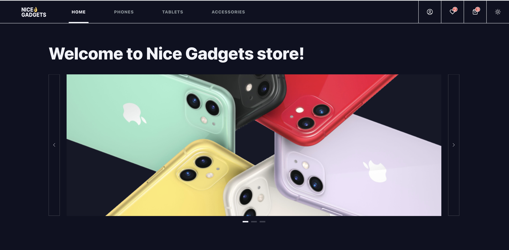

# MyGadgets - Online Store

This single-page application offers a comprehensive online store experience. Users can browse products, add them to their cart and favorites, search and sort products, adjust product quantities in the cart, and access detailed product information. The app also provides the option to switch between Dark and Light themes. It incorporates user authentication and authorization for secure access. All data is retrieved from the server, and the application boasts a user-friendly UI with a responsive design, ensuring compatibility across various screen sizes

# [DEMO](https://fe-may23-syncwave.github.io/client/#/)

# Technologies used

- React.js
- React Router(v6)
- TypeScript
- Sass (SCSS)
- Axios
- Formik
- LoDash
- Swiper
- React-toastify
- Node.js
- Express.js
- PostgreSQL (Sequelize-typescript)
